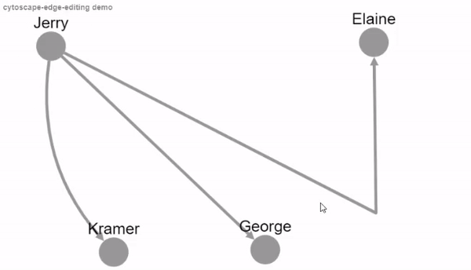

cytoscape-edge-editing
================================================================================

## Description

A Cytoscape.js extension enabling interactive editing of edge bend and control points for segment and unbundled bezier edges, respectively. It also allows for reconnection of edges to other source/target nodes. The extension is distributed under [The MIT License](https://opensource.org/licenses/MIT). 
 * The term 'anchor' will be used here and in the code to refer to bend and control points collectively.
 * To highlight anchor positions of an edge you should select the edge and unselect any other edges. Note that in determining the edge to highlight the anchor positions we assume that the unvisible edges are not selected.
 * To add an anchor select the edge and unselect any other edge, right click where you want to add the anchor and click 'Add Bend Point' or 'Add Control Point' on the context menu (requires 'cytoscape.js-context-menus' extension). The context menu will distiguish between the edges and it will not be possible to a bend point on an unbundled bezier edge and vice versa.
 * Bend points or control points can be added to edges which are not of type segments or unbundled bezier. The edge will then become segemetns or unbundled bezier accordingly.
 * To remove an anchor select the edge and unselect any other edge, right click on the anchor and click 'Remove Bend Point' or 'Remove Control Point' on the context menu (requires 'cytoscape.js-context-menus' extension). 
 * To move an anchor drag and drop it when the edge is the only selected edge.
 * Alternatively, 
    * You can click anywhere on the edge (if it is the only selected edge) to introduce and relocate an anchor by dragging.
    * A bend point is removed if it is dropped near the line segment between its two neighbours.
 * Drag and drop can also be used to quickly create and drag an anchor on a highlighted edge. The anchor type will be decided based on the edge type. This will not work with edges which are not segments or unbundled bezier.
 * To reconnect an edge, select the handle (source or target), drag and drop on the new (source or target) node.
 


Please cite the following paper when using this extension:

U. Dogrusoz , A. Karacelik, I. Safarli, H. Balci, L. Dervishi, and M.C. Siper, "[Efficient methods and readily customizable libraries for managing complexity of large networks](https://doi.org/10.1371/journal.pone.0197238)", PLoS ONE, 13(5): e0197238, 2018.

Here is a demo:
<p align="center">
<a href="https://raw.githack.com/iVis-at-Bilkent/cytoscape.js-edge-editing/unstable/demo.html"></a>
</p>

## Dependencies

 * Cytoscape.js ^3.3.0
 * jQuery ^1.7.0 || ^2.0.0 || ^3.0.0
 * Konva ^7.0.3
 * cytoscape-undo-redo.js(optional) ^1.0.1
 * cytoscape-context-menus.js(optional) ^2.0.0


## Usage instructions

Download the library:
 * via npm: `npm install cytoscape-edge-editing`,
 * via bower: `bower install cytoscape-edge-editing`, or
 * via direct download in the repository (probably from a tag).

`require()` the library as appropriate for your project:

CommonJS:
```js
var cytoscape = require('cytoscape');
var jquery = require('jquery');
var konva = require('konva');
var edgeEditing = require('cytoscape-edge-editing');

edgeEditing( cytoscape, jquery, konva ); // register extension
```

AMD:
```js
require(['cytoscape', 'cytoscape-edge-editing', 'jquery', 'konva'], function( cytoscape, edge-editing, jquery, konva ){
  edge-editing( cytoscape, jquery, konva ); // register extension
});
```

Plain HTML/JS has the extension registered for you automatically, because no `require()` is needed.


## API

```js
var instance = cy.edgeEditing( options );
```

An instance has a number of functions available:

```js
/*
* Get anchors of the given edge in an array A,
* A[2 * i] is the x coordinate and A[2 * i + 1] is the y coordinate
* of the ith anchor. (Returns undefined if the curve style is not segments nor unbundled bezier)
*/
instance.getAnchorsAsArray(ele);
// Initilize anchors for the given edges using 'options.bendPositionsFunction' and 'options.controlPositionsFunction'
instance.initAnchorPoints(eles);
// Removes anchor with some index from an edge
instance.deleteSelectedAnchor(ele, index);
// Get type of an edge as `bend`, `control` or `none`
instance.getEdgeType(ele);
```

You can also get an existing instance:

```js
cy.edgeEditing('get'); // Returns undefined if the extension is not initialized yet
```

Or you can check if the extension is initilized before
```js
cy.edgeEditing('initialized');
```

## Default Options
```js
    var options = {
      // A function parameter to get bend point positions, should return positions of bend points
      bendPositionsFunction: function(ele) {
        return ele.data('bendPointPositions');
      },
      // A function parameter to get control point positions, should return positions of control points
      controlPositionsFunction: function(ele) {
        return ele.data('controlPointPositions');
      },
      // A function parameter to set bend point positions
      bendPointPositionsSetterFunction: function(ele, bendPointPositions) {
        ele.data('bendPointPositions', bendPointPositions);
      },
      // A function parameter to set bend point positions
      controlPointPositionsSetterFunction: function(ele, controlPointPositions) {
        ele.data('controlPointPositions', controlPointPositions);
      },
      // whether to initilize bend and control points on creation of this extension automatically
      initAnchorsAutomatically: true,
      // the classes of those edges that should be ignored
      ignoredClasses: [],
      // whether the bend editing operations are undoable (requires cytoscape-undo-redo.js)
      undoable: false,
      // the size of bend and control point shape is obtained by multipling width of edge with this parameter
      anchorShapeSizeFactor: 3,
      // z-index value of the canvas in which bend points are drawn
      zIndex: 999,
       /*An option that controls the distance (in pixels) within which a bend point is considered near the line segment between 
         its two neighbors and will be automatically removed
         min value = 0 , max value = 20 , values less than 0 are set to 0 and values greater than 20 are set to 20
       */
      bendRemovalSensitivity : 8,
      // title of add bend point menu item (User may need to adjust width of menu items according to length of this option)
      addBendMenuItemTitle: "Add Bend Point",
      // title of remove bend point menu item (User may need to adjust width of menu items according to length of this option)
      removeBendMenuItemTitle: "Remove Bend Point",
      // title of remove all bend points menu item
      removeAllBendMenuItemTitle: "Remove All Bend Points",
      // title of add control point menu item (User may need to adjust width of menu items according to length of this option)
      addControlMenuItemTitle: "Add Control Point",
      // title of remove control point menu item (User may need to adjust width of menu items according to length of this option)
      removeControlMenuItemTitle: "Remove Control Point",
      // title of remove all control points menu item
      removeAllControlMenuItemTitle: "Remove All Control Points",
      // whether 'Remove all bend points' and 'Remove all control points' options should be presented to the user
      enableMultipleAnchorRemovalOption: false,
      // whether the bend and control points can be moved by arrows
      moveSelectedAnchorsOnKeyEvents: function () {
          return true;
      },
      // this function handles reconnection of the edge, if undefined simply connect edge to its new source/target 
      // handleReconnectEdge (newSource.id(), newTarget.id(), edge.data())
      handleReconnectEdge: undefined,
      // this function checks validation of the edge and its new source/target
      validateEdge: function (edge, newSource, newTarget) {
         return 'valid';
      },
      // this function is called if reconnected edge is not valid according to validateEdge function
      actOnUnsuccessfulReconnection: undefined,
      // specifically for edge-editing menu items, whether trailing dividers should be used
      useTrailingDividersAfterContextMenuOptions: false,
      // Enable / disable drag creation of anchor points when there is at least one anchor already on the edge
      enableCreateAnchorOnDrag: true
    };
```

## Build targets

* `npm run build` : Build `./src/**` into `cytoscape-edge-editing.js` in production environment and minimize the file.
* `npm run build:dev` :  Build `./src/**` into `cytoscape-edge-editing.js` in development environment without minimizing the file.

## Publishing instructions

This project is set up to automatically be published to npm and bower.  To publish:

1. Build the extension : `npm run build`
1. Commit the build : `git commit -am "Build for release"`
1. Bump the version number and tag: `npm version major|minor|patch`
1. Push to origin: `git push && git push --tags`
1. Publish to npm: `npm publish .`
1. If publishing to bower for the first time, you'll need to run `bower register cytoscape-edge-editing https://github.com/iVis-at-Bilkent/cytoscape.js-edge-editing.git`

## Team

  * [Muhammed Salih Altun](https://github.com/msalihaltun), [Gledis Zeneli](https://github.com/gledis69), [Ugur Dogrusoz](https://github.com/ugurdogrusoz) of [i-Vis at Bilkent University](http://www.cs.bilkent.edu.tr/~ivis)

### Alumni

  * [Metin Can Siper](https://github.com/metincansiper), [Ahmet Candiroglu](https://github.com/ahmetcandiroglu)
